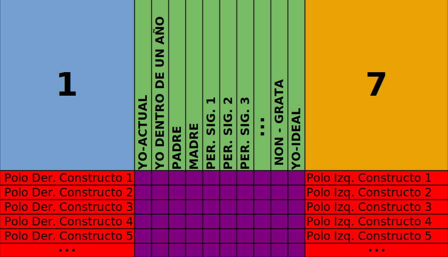
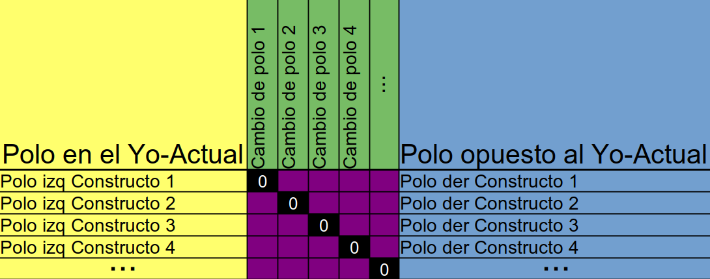

```{r, include = FALSE}
knitr::opts_chunk$set(
  collapse = TRUE,
  comment = "#>"
)
```

```{r setup, include = FALSE}
knitr::opts_chunk$set(
)
library(GridFCM)
```

## INTRODUCCIÓN

  GridFCM es un paquete de R que nos permite construir Mapas Cognitivos Borrosos (MCB) del sistema de constructos de una persona. Para cumplir con este propósito, la herramienta principal que utiliza es la Rejilla de Implicaciones (ImpGrid). Con la que podemos explorar las relaciones de causalidad que existe entre los constructos personales del individuo.
  
  Sin embargo, para mejorar la interpretación de los mapas y dotarles de mayor información también es necesario aplicar la Técnica de Rejilla (TR). Con esta obtenemos información adicional que ayudará a complementar los MCB.
  
  Así que si queremos explorar el MCB de una persona a través de GridFCM debemos importar dos fuentes de datos en el entorno de R:
  
  - La Técnica de Rejilla del Individuo
  - La Rejilla de Implicaciones del Individuo

Es importante matizar que ambas deben tener los mismos constructos personales y haber sido administradas en el mismo momento temporal.

## IMPORTANDO LA TÉCNICA DE REJILLA

Para importar la técnica de rejilla haremos uso de las herramientas que nos aporta el paquete OpenRepGrid de R. Sin embargo, para el buen procesamiento de la rejilla por parte de GridFCM necesitamos que cumpla con unos criterios particulares. Es por eso que importaremos los datos a través del código incluido dentro del paquete GridFCM que mostramos a continuación:

```{r eval = FALSE}
importGRID("ruta del archivo de excel")
```

*(Más información sobre el código escribiendo `?importGRID` en la consola de R)*

Este código hereda todos los argumentos de la función `importExcel()` del paquete OpenRepGrid. Así que podemos editar y trabajar con ella de la misma forma. Además, a la hora de importar debemos seguir la misma plantilla que seguimos en OpenRepGrid a la hora de estructurar los datos dentro del excel.

Aquí podemos ver la plantilla de cómo se deben estructurar los datos en el excel:

{width="100%"}

 - **Elementos de la Rejilla:** La <span style="color : green"> parte verde </span> de la rejilla está destinada para los elementos. Es aquí donde deberemos colocar todos los elementos que queramos analizar. Para un buen procesamiento por parte de GridFCM se recomienda colocar el Yo-Actual en la primera columna y el Yo-Ideal en la última; si no se hace de esta forma, a la hora de aplicar las funciones del paquete deberá prestar atención a su configuración por defecto.
 
 - **Constructos Personales de la Rejilla:** En la <span style="color : red"> parte roja </span> de la rejilla debemos colocar los constructos personales del sujeto. Los polo derechos a la derecha y los polos izquierdos a la izquierda. El orden de colocación no es relevante a la hora de escribir los polos de los constructos, ya que la función `importGRID()` alineará automáticamente los polos de acuerdo a las necesidades de GridFCM. 
 
 - **Escala de puntuaciones:** Las esquinas superiores de la tabla de excel están reservadas para informar al software de la escala que se está utilizando. En la <span style="color : blue"> parte azul </span> deberemos colocar la puntuación mínima de la escala; la que representaría la máxima expresión del polo izquierdo del constructo.Y en la <span style="color : orange"> parte naranja </span> deberemos poner la puntuación maxima de la escala; que representaría la máxima expresión del polo derecho del constructo.
 
 - **Matriz de puntuaciones:** La <span style="color : purple"> parte morada </span> se reserva para las puntuaciones de cada uno de los elementos sobre los diferentes constructos personales. Es importante tener en cuenta la escala que hemos establecido a la hora de colocar las puntuaciones. 

## IMPORTANDO LA REJILLA DE IMPLICACIONES

A la hora de importar la rejilla de implicaciones debemos tener en cuenta cómo ha sido administrada. Ya que existen diversas formas de aplicarla y en función de ello debemos estructurar nuestra base de datos de forma distinta para que GridFCM sea capaz de leerla. Aun así, sea cual sea la estructura elegida, utilizaremos el siguiente código para importar la rejilla de implicaciones:

```{r eval=FALSE}
# Si utilizamos el método de Hinkle:
importIMP("ruta del archivo de excel", method = "Hinkle")

 # Si utilizamos el método de Fransella:
importIMP("ruta del archivo de excel", method = "Fransella")
```


A continuación, os muestro cómo estructurar estos datos en función del método que hayamos escogido.

### IMPGRID SEGÚN HINKLE

La primera forma que tenemos de aplicar la ImpGrid para GridFCM deriva del método de Hinkle(1965). La idea principal consiste en preguntar al sujeto que implicaciones tendría un cambio de polo en los diferentes constructos personales del Yo-Actual. De esta forma, podemos deducir que consecuencias tienen las variaciones de un constructo sobre el resto.

Para recoger los datos debemos confeccionar una pregunta para cada uno de los constructos personales de los individuos. En ella, se preguntará si un cambio de polo en su Yo-Actual en el constructo referido provocaría cambios en algun otro constructo. El sujeto deberá matizar la dirección e intensidad de dicho cambio. Por ejemplo, una persona puede pensar que si pasase de ser *mala persona* a *buena persona* también sería mucho más *solidaria* y levemente más *popular*.  

Si seguimos este método a la hora de aplicar la ImpGrid debemos estructurar la información en un excel siguiendo el siguiente patrón:

{width="100%"}


  - **Polos del Yo-Actual:** En la <span style="color : yellow"> parte amarilla </span> de la plantilla se colocan por filas los polos de los constructos dónde se encuentra el Yo-Actual del individuo. Veáse, si un sujeto ha puntuado 2 en el constructo *Bueno - Malo* en el elemento del Yo-Actual debemos poner en esta casilla el polo *Bueno*.
  
  - **Polos Opuestos del Yo-Actual:** En la <span style="color : blue"> parte azul </span> de la plantilla se colocan los polos opuestos a los que hemos puesto en la parte amarilla. De esta forma tendremos los constructos personales de la rejilla colocados por filas y orientados según el Yo-Actual. Siguiendo el ejemplo anterior en esta casilla deberíamos poner el polo *Malo*.
  
  - **Cambios en los Constructos:** La <span style="color : green"> parte verde </span> de la plantilla está destinada para los constructos de los que nacen las implicaciones. En el caso de la ImpGrid de Hinkle, estos se expresan a través de un cambio de polo de su Yo-Actual al polo opuesto de este. Un ejemplo sería *Bueno -> Malo*, donde se analizarían las implicaciones que tiene el hecho de que un individuo pase de ser bueno a ser malo.
  
  - **Matriz de Puntuaciones:** En la <span style="color : purple"> parte morada </span> debemos escribir las distintas puntuaciones de las implicaciones dentro de un intervalo de [-3,3]. Un valor negativo implicaría que el <span style="color : green"> cambio de polo </span> tiene asociado un cambio hacia el <span style="color : yellow"> polo de la izquierda</span>, un valor positivo implicaria un cambio hacia el <span style="color : blue"> polo de la derecha </span>, y un 0 implicaria que el <span style="color : green"> cambio de polo </span> no tiene efecto. Asimismo, un 1 sería un cambio leve, un 2 sería un cambio moderado, y un 3 sería  un cambio fuerte.

Teniendo en cuenta este patron el resultado final sería una matriz que contiene las implicaciones de cada uno de los constructos con el resto de constructos. Los vectores columnas tendrían como elementos cada una de las salidas de causalidad y los elementos de los vectores fila serían las entradas de causalidad.

Podemos crear una plantilla personalizada con este patrón con la función `templateIMP()`. Esta función nos crea un documento de excel en nuestro espacio de trabajo que contiene una tabla personalizada, con los constructos personales de la técnica de rejilla que hayamos escogido, lista para introducir los valores de las implicaciones. El argumento que nos pide esta funcion es unicamente un objeto `RepGrid` introducido con la función `importGRID()`.

### IMPGRID SEGÚN FRANSELLA

***NO IMPLEMENTADA EN EL PAQUETE***

## REFERENCIAS
Hinkle, D. N. (1965). The change of personal constructs from the viewpoint of a theory of construct implications (Doctoral dissertation, The Ohio State University).​
